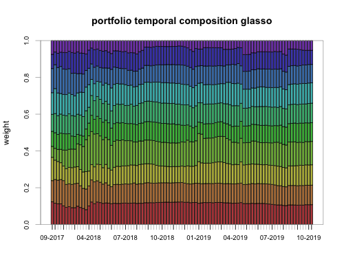
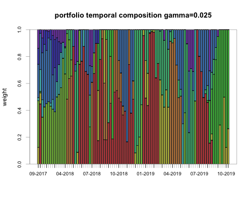
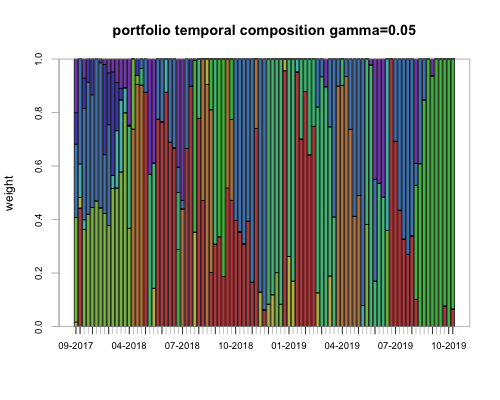
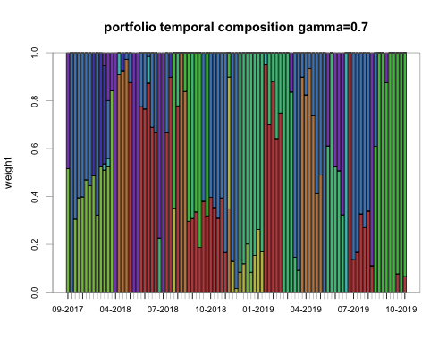
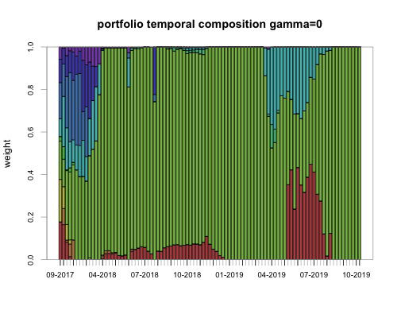
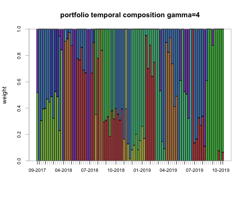

[](http://quantlet.de/)

## [](http://quantlet.de/) **MSTCC_Weights** [](http://quantlet.de/)

```yaml

Name of Quantlet: 'MSTCC_Weights'

Published in: 'Quantinar'

Description: 'Compare the weights of different portfolios using different parameter gamma.'

Submitted:  '18 Oct 2022'

Keywords: 
- 'Minimum Spaning Tree'
- 'Portfolio weights'

Author: 
- 'Zijin Wang'
- 'Wolfgang Karl Härdle'
- 'Rui Ren'

```
















### R Code
```r

# codes originate from Giudici P, et al. (2020). "Network Models to Enhance Automated Cryptocurrency Portfolio Management."

rm(list = ls())

library(PerformanceAnalytics)
library(xts)
library(quantmod)
library(timeSeries)
library(xtable)
library(igraph)
library(tcltk2)
library(MTS)
library(matrixcalc)
library(Matrix)
library(fPortfolio)
library(IntroCompFinR)  #install.packages("IntroCompFinR", repos="http://R-Forge.R-project.org")
require(quadprog)
library(pracma)
library(glasso)

setwd("~/Documents/METIS/Minimum Spanning Tree/Codes/MSTCC_Weights")
prices<-read.table("def.csv", header=TRUE, sep=",", dec=".")
ZOO <- zoo(prices[,-1], order.by=as.Date(as.character(prices$Date), format='%m/%d/%Y'))

#return
return<- Return.calculate(ZOO, method="log")
return<- return[-1, ]
returnstd<-xts(return)
class(return)
dim(return)

W<-list()
for(t in 0: 92){
  W[[(t+1)]]=returnstd[(1+t*7):(120+t*7),]
}
W_in<-list()
W_out<-list()
for(t in 1: 93){
  W_in[[(t)]]=W[[t]][c(1:113),]
  W_out[[(t)]]=W[[t]][c(114:120),]
}

# RMT: get "lambda_max"

M<-matrix(rnorm(10*113, mean=0,sd=1),10,113)
E<-t(M)
O<-M%*%E
L<-1/113
R<-L*O
eigen(R, symmetric = TRUE)
eigen_R<-eigen(R, symmetric = TRUE)$values
Q<-113/10

lambda_max<-(1+1/Q+2*sqrt(1/Q))   ##taking into account the behaviour of the first eigenvalue
lambda_max
lambda_min<-(1+1/Q-2*sqrt(1/Q))
lambda_min

# Get filtered eigenvalue and eigenvector
C <- list()        # correlation matrix
lambda_C<-list()   # eigenvalue and eigenvector of correlation matrix
eigen_C<-list()    # eigenvalue of correlation matrix
eigenvec_C<-list() # eigenvector of correlation matrix
for(t in 1: length(W_in)){
  C[[(t)]] =cor(W_in[[(t)]])
  lambda_C[[t]]<-eigen(C[[t]], symmetric = TRUE)
  eigen_C[[t]]<-lambda_C[[t]]$values
  eigenvec_C[[t]]<-lambda_C[[t]]$vectors
}

# sort "eigen_C" by ascent
for(i in 1:10){
  for (t in 1:93) {
    if(eigen_C[[t]][i]<lambda_max){eigen_C[[t]][i]=0}
    eigen_C[[t]]<-sort(eigen_C[[t]])  # I think we do NOT need to sort
  }
}

filtered_diagonal_C<-list()  # filtered diagnal matrix of eigenvalue
V<-list()                    # eigenvector from 10 to 1
f<-list()                    # transport of V
C_1<-list()                  # filtered correlation matrix
Dist <- list()               # distance matrix

for(t in 1: length(W_in)){
  filtered_diagonal_C[[t]]<-diag(eigen_C[[t]])
  V[[t]]<-eigenvec_C[[t]]
  V[[t]]<-eigenvec_C[[t]][,10:1]  # I think we do NOT need to sort from 10 to 1
  f[[t]]<-t(V[[t]])
  C_1[[t]]<-V[[t]]%*%filtered_diagonal_C[[t]]%*%f[[t]]
  diag(C_1[[t]])<-1               # I think we do NOT need to sign 1 to diagonal 
  C_1[[t]]<-as.matrix(C_1[[t]])
  diag(C_1[[t]])<-1
  Dist[[t]]<-sqrt(2-2*C_1[[t]])
  Dist[[t]]<-as.matrix(Dist[[t]])
  Dist[[t]][is.nan(Dist[[t]])]<-0              # why nan? I think it may be set as inf
  colnames(Dist[[(t)]])<-colnames(returnstd)
  rownames(Dist[[(t)]])<-colnames(returnstd)
}
# what's the difference between Dist and ciao? I think it is the SAME
ciao<-list()
for(t in 1: length(W)){
  ciao[[t]]<-as.numeric(unlist(Dist[[t]]))
  ciao[[t]]<-matrix(ciao[[t]],10,10)
  colnames(ciao[[t]])<-colnames(returnstd)
  rownames(ciao[[t]])<-colnames(returnstd)
}

# create network of distance matrix
A<-list()
network<-list()  # network of filtered correlation matrix
Edgelist<-list() # edges of network
weight<-list()   # weight of network
links2<-list()   # links of network
for(t in 1: length(W)){
  network[[t]]=graph_from_adjacency_matrix(ciao[[t]],weighted=T, mode="undirected", diag=F)
  Edgelist[[t]]<-get.edgelist(network[[t]])
  weight[[t]]<-E(network[[t]])$weight
  A[[t]]<-cbind(Edgelist[[t]],weight[[t]])
  A[[t]]<-as.matrix(A[[t]])
  links2[[t]]<-as.data.frame(A[[t]])
  colnames(links2[[t]])<-c("from","to","weight")
}

# generate MST
weightmst<-list()      # maximum weight of MST
net<-list()            # net of data
mst<-list()            # minimum spanning tree
deg<-list()            # number of edges connecting to one point
root<-list()           # name of crypto with most edges in MST
deg_vert<-list()       # minus "deg"
centralization<-list() # centralize a graph according to the eigenvector centrality ofvertices
def_matrix<-list()
red<-list()
res<-list()
for(t in  1: length(W)){
  net[[t]] <- graph_from_data_frame(d=links2[[t]], directed=F)
  mst[[t]] <- minimum.spanning.tree(net[[t]])
  weightmst[[t]]<-max(E(mst[[t]])$weight)
  wei<-unlist(weightmst[[t]])
  deg[[t]]<-degree(mst[[t]])
  centralization[[t]]<-centr_eigen(mst[[t]])$centralization # not know "centr_eigen"
  centr<-as.matrix(unlist(centralization))
  deg_vert[[t]]<- -(deg[[t]])
  root[[t]]<-names(deg[[t]])[deg[[t]]== max(deg[[t]])]
  def_matrix[[t]]<-ciao[[t]]-(as_adjacency_matrix(mst[[t]])*ciao[[t]])
  def_matrix[[t]][def_matrix[[t]] == 0] <- 5 # diagonal and edges in MST are set as 5. but WHY?
  def_m<-as.matrix(unlist(def_matrix[[t]]))
  de<-vec(def_m)
  red[[t]]<-sum(de < wei )/sum(de > wei )    # did NOT use "red"
  a<-subset(de,de<wei)
  b<-subset(de,de>wei)
  res[[t]]<-sum(b^-1)/sum(a^-1)
}

# eigenvector centrality
EIGEN_cent<-list()
eigencent<-list()
for(t in 1: length(W)){
  EIGEN_cent[[t]]<-eigen_centrality(mst[[t]], directed = FALSE, scale = TRUE,options = arpack_defaults)
  eigencent[[t]]<-EIGEN_cent[[t]]$vector
  round(eigencent[[t]],3)
  eigencent[[t]]<-as.matrix(eigencent[[t]])
  eigencent[[t]]<- -(eigencent[[t]]) # later in solve.QP we need possitive eigen cent so we add minus here
}

# calculate variance-covariance matrix
r<-list()
meanret<-list() # mean return of 10 crypto
stdev<-list()   # standard deviation of 10 crypto
g<-list()
COVrmt<-list()  # variance-covariance matrix
for(t in 1: length(W_in)){
  r[[t]] <- matrix(colMeans(W_in[[t]]), nrow=1)
  meanret[[t]]<-sum(r[[t]])/10
  stdev[[t]]<-apply(W_in[[t]],2,sd)
  stdev[[t]]<-matrix(stdev[[t]]) #sd vector
  rownames(stdev[[t]])<-colnames(W_in[[t]])
  g[[t]]<-stdev[[t]]%*%t(stdev[[t]])
  COVrmt[[t]]<-g[[t]]*C_1[[t]]
  COVrmt[[t]]<-as.matrix(COVrmt[[t]])
}

# generate timeline "cri" for later portfolio
date<-prices$Date
date<-as.Date.factor(date[-c(1:116)], format="%m/%d/%Y")
meanlayer1<-list()
for(t in 1: 93){
  meanlayer1[[t]]<-date[[t*7]]
}
meanlayer1<-as.Date(unlist(meanlayer1))
psi<-data.frame(meanlayer1)
fixi<-"2017-09-14"     # can not combine
fixi<-data.frame(fixi) # can not combine
psi<-t(psi)
gloxi<-t(data.frame(fixi$fixi,psi))  # can not combine
gloxia<-data.frame(gloxi)            # can not combine
glox<-as.data.frame(gloxia$meanlayer1) # can not combine
glox<-data.frame(glox)                 # can not combine
glox<-as.matrix(glox$gloxia.meanlayer1)
glox<-glox[-94]
cri<-as.Date(as.character(glox)) # from "2017-09-14" to "2019-10-12", but there is a jump from "2017-09-14" to "2018-01-13"

# generate gamma=1 portfolio and equally weighted portfolio
B<-list()
f<-list()
sol<-list()              # solution of Quadratic Programming Problem
w<-list()                # weights of gamma=1 portfolio
z<-list()
z1<-list()
pport1<-list()           # gamma=1 portfolio value of each day in out-of-sample
#retport<-list()          # mean value of gamma=1 portfolio in out-of-sample
#retport1<-list()        # standard deviation of gamma=1 portfolio value in out-of-sample
pport_equally<-list()    # equally weighted portfolio value of each day in out-of-sample
#retportequally<-list()   # mean value of equally weighted portfolio in out-of-sample
#retport1equally<-list() # standard deviation of equally weighted portfolio value in out-of-sample
for(t in 1: 93){ 
  B[[t]]<- rbind(matrix(1,1,10), r[[t]], diag(10),-diag(10))
  f[[t]]<- c(1, meanret[[t]], rep(0,10),rep(-1,10))
  sol[[t]]<- solve.QP(Dmat=COVrmt[[t]], dvec = eigencent[[t]], Amat=t(B[[t]]), bvec=f[[t]], meq=1)
  w[[t]]<-matrix(round(sol[[t]]$solution,6))
  aus<-as.matrix(repmat(w[[t]],1,7)*t(W_out[[t]])) # 10-by-7 times 10-by-7 equals 10-by-7, HOW?
  pport1[[t]]<-colSums(aus)
  #retport[[t]]<-mean(colSums(aus))
  #retport1[[t]]<-sd(colSums(aus))
  # equally weighted portfolio
  equallyweighted<-matrix(rep(1/10),10,1)
  ausequally<-as.matrix(repmat(equallyweighted,1,7)*t(W_out[[t]]))
  pport_equally[[t]]<-colSums(ausequally)
  #retportequally[[t]]<-mean(colSums(ausequally))
  #retport1equally[[t]]<-sd(colSums(ausequally))
}
# cumulated returns of gamma=1 portfolio and equally weighted portfolio
pport1<-as.matrix(cbind(unlist(pport1)))               # returns of gamma=1 portfolio in out-of-sample
pport_equally<-as.matrix(cbind(unlist(pport_equally))) # returns of equally weighted portfolio in out-of-sample
pcum1<-cumsum(pport1)                                  # cumulated returns of gamma=1 portfolio in out-of-sample
pcum_equally<-cumsum(pport_equally)                    # cumulated returns of equally weighted portfolio in out-of-sample
#retport<-as.matrix(unlist(retport))                   # returns of gamma=1 portfolio for each week in out-of-sample
#retport<-cumsum(retport)                              # cumulated returns of gamma=1 portfolio for each week in out-of-sample
#retport1<-as.matrix(unlist(retport1))                 # sd of gamma=1 portfolio for each week in out-of-sample
#retport1<-cumsum(retport1)                            # cumulated as of gamma=1 portfolio for each week in out-of-sample
#retportequally<-as.matrix(unlist(retportequally))     # returns of equally weighted portfolio for each week in out-of-sample
#retport1equally<-as.matrix(unlist(retport1equally))   # sd of equally weighted portfolio for each week in out-of-sample
# plot weights evolution of gamma=1 portfolio 
AI<-matrix(unlist(w),10,93)
rownames(AI)<-colnames(return)
colnames(AI)<-c(1:93)
AI<-t(AI)
xptf<-zoo(AI,cri) # weights of gamma=1 portfolio
png("MSTCC_weight_lambda1.png", width=500, height=400, bg = "transparent")
chart.StackedBar(xptf, ylab= "weight", date.format="%m-%Y", legend.loc = "NULL", colorset=rainbow12equal, main="portfolio temporal composition gamma=1")
dev.off()

# generate gamma=0
B<-list()
f<-list()
sol<-list()
w<-list()
z<-list()
z1<-list()
port0<-list()
for(t in 1: 93){ 
  B[[t]]<- rbind(matrix(1,1,10), r[[t]], diag(10),-diag(10))
  f[[t]]<- c(1, meanret[[t]], rep(0,10),rep(-1,10))
  sol[[t]]<- solve.QP(Dmat=COVrmt[[t]], dvec = matrix(0,10,1), Amat=t(B[[t]]), bvec=f[[t]], meq=1)
  w[[t]]<-matrix(round(sol[[t]]$solution,6))
  aus<-as.matrix(repmat(w[[t]],1,7)*t(W_out[[t]]))
  port0[[t]]<-colSums(aus)
}
pport0<-as.matrix(cbind(unlist(port0)))
pcum0<-cumsum(pport0)
# plot weights evolution of gamma=0 portfolio 
AI<-matrix(unlist(w),10,93)
rownames(AI)<-colnames(return)
colnames(AI)<-c(1:93)
AI<-t(AI)
xptf<-zoo(AI,cri)
png("MSTCC_weight_lambda0.png", width=500, height=400, bg = "transparent")
chart.StackedBar(xptf, ylab= "weight", date.format="%m-%Y", legend.loc = "NULL", colorset=rainbow12equal, main="portfolio temporal composition gamma=0")
dev.off()

# generate gamma=0.005
B<-list()
f<-list()
sol<-list()
w<-list()
z<-list()
z1<-list()
port0.005<-list()
for(t in 1: 93){ 
  B[[t]]<- rbind(matrix(1,1,10), r[[t]], diag(10),-diag(10))
  f[[t]]<- c(1, meanret[[t]], rep(0,10),rep(-1,10))
  sol[[t]]<- solve.QP(Dmat=COVrmt[[t]], dvec = 0.005*eigencent[[t]], Amat=t(B[[t]]), bvec=f[[t]], meq=1)
  w[[t]]<-matrix(round(sol[[t]]$solution,6))
  aus<-as.matrix(repmat(w[[t]],1,7)*t(W_out[[t]]))
  port0.005[[t]]<-colSums(aus)
}
pport0.005<-as.matrix(cbind(unlist(port0.005)))
pcum0.005<-cumsum(pport0.005)
# plot weights evolution of gamma=0.005 portfolio 
AI<-matrix(unlist(w),10,93)
rownames(AI)<-colnames(return)
colnames(AI)<-c(1:93)
AI<-t(AI)
xptf<-zoo(AI,cri)
png("MSTCC_weight_lambda0.005.png", width=500, height=400, bg = "transparent")
chart.StackedBar(xptf, ylab= "weight", date.format="%m-%Y", legend.loc = "NULL", colorset=rainbow12equal, main="portfolio temporal composition gamma=0.005")
dev.off()

# generate gamma=0.025
B<-list()
f<-list()
sol<-list()
w<-list()
z<-list()
z1<-list()
port0.025<-list()
for(t in 1: 93){ 
  B[[t]]<- rbind(matrix(1,1,10), r[[t]], diag(10),-diag(10))
  f[[t]]<- c(1, meanret[[t]], rep(0,10),rep(-1,10))
  sol[[t]]<- solve.QP(Dmat=COVrmt[[t]], dvec = 0.025*eigencent[[t]], Amat=t(B[[t]]), bvec=f[[t]], meq=1)
  w[[t]]<-matrix(round(sol[[t]]$solution,6))
  aus<-as.matrix(repmat(w[[t]],1,7)*t(W_out[[t]]))
  port0.025[[t]]<-colSums(aus)
}
pport0.025<-as.matrix(cbind(unlist(port0.025)))
pcum0.025<-cumsum(pport0.025)
# plot weights evolution of gamma=0.15 portfolio 
AI<-matrix(unlist(w),10,93)
rownames(AI)<-colnames(return)
colnames(AI)<-c(1:93)
AI<-t(AI)
xptf<-zoo(AI,cri)
png("MSTCC_weight_lambda0.025.png", width=500, height=400, bg = "transparent")
chart.StackedBar(xptf, ylab= "weight", date.format="%m-%Y", legend.loc = "NULL", colorset=rainbow12equal, main="portfolio temporal composition gamma=0.025")
dev.off()

# generate gamma=0.05 portfolio
B<-list()
f<-list()
sol<-list()
w<-list()
z<-list()
z1<-list()
port0.05<-list()
for(t in 1: 93){ 
  B[[t]]<- rbind(matrix(1,1,10), r[[t]], diag(10),-diag(10))
  f[[t]]<- c(1, meanret[[t]], rep(0,10),rep(-1,10))
  sol[[t]]<- solve.QP(Dmat=COVrmt[[t]], dvec = 0.05*eigencent[[t]], Amat=t(B[[t]]), bvec=f[[t]], meq=1)
  w[[t]]<-matrix(round(sol[[t]]$solution,6))
  aus<-as.matrix(repmat(w[[t]],1,7)*t(W_out[[t]]))
  port0.05[[t]]<-colSums(aus)
}
pport0.05<-as.matrix(cbind(unlist(port0.05)))
pcum0.05<-cumsum(pport0.05)
# plot weights evolution of gamma=0.05 portfolio 
AI<-matrix(unlist(w),10,93)
rownames(AI)<-colnames(return)
colnames(AI)<-c(1:93)
AI<-t(AI)
xptf<-zoo(AI,cri)
png("MSTCC_weight_lambda0.05.png", width=500, height=400, bg = "transparent")
chart.StackedBar(xptf, ylab= "weight", date.format="%m-%Y", legend.loc = "NULL", colorset=rainbow12equal, main="portfolio temporal composition gamma=0.05")
dev.off()

# generate gamma=0.15
B<-list()
f<-list()
sol<-list()
w<-list()
z<-list()
z1<-list()
port0.15<-list()
for(t in 1: 93){ 
  B[[t]]<- rbind(matrix(1,1,10), r[[t]], diag(10),-diag(10))
  f[[t]]<- c(1, meanret[[t]], rep(0,10),rep(-1,10))
  sol[[t]]<- solve.QP(Dmat=COVrmt[[t]], dvec = 0.15*eigencent[[t]], Amat=t(B[[t]]), bvec=f[[t]], meq=1)
  w[[t]]<-matrix(round(sol[[t]]$solution,6))
  aus<-as.matrix(repmat(w[[t]],1,7)*t(W_out[[t]]))
  port0.15[[t]]<-colSums(aus)
}
pport0.15<-as.matrix(cbind(unlist(port0.15)))
pcum0.15<-cumsum(pport0.15)
# plot weights evolution of gamma=0.15 portfolio 
AI<-matrix(unlist(w),10,93)
rownames(AI)<-colnames(return)
colnames(AI)<-c(1:93)
AI<-t(AI)
xptf<-zoo(AI,cri)
png("MSTCC_weight_lambda0.15.png", width=500, height=400, bg = "transparent")
chart.StackedBar(xptf, ylab= "weight", date.format="%m-%Y", legend.loc = "NULL", colorset=rainbow12equal, main="portfolio temporal composition gamma=0.15")
dev.off()

# generate gamma=0.7
B<-list()
f<-list()
sol<-list()
w<-list()
z<-list()
z1<-list()
port0.7<-list()
for(t in 1: 93){ 
  B[[t]]<- rbind(matrix(1,1,10), r[[t]], diag(10),-diag(10))
  f[[t]]<- c(1, meanret[[t]], rep(0,10),rep(-1,10))
  sol[[t]]<- solve.QP(Dmat=COVrmt[[t]], dvec = 0.7*eigencent[[t]], Amat=t(B[[t]]), bvec=f[[t]], meq=1)
  w[[t]]<-matrix(round(sol[[t]]$solution,6))
  aus<-as.matrix(repmat(w[[t]],1,7)*t(W_out[[t]]))
  port0.7[[t]]<-colSums(aus)
}
pport0.7<-as.matrix(cbind(unlist(port0.7)))
pcum0.7<-cumsum(pport0.7)
# plot weights evolution of gamma=0.7 portfolio 
AI<-matrix(unlist(w),10,93)
rownames(AI)<-colnames(return)
colnames(AI)<-c(1:93)
AI<-t(AI)
xptf<-zoo(AI,cri)
png("MSTCC_weight_lambda0.7.png", width=500, height=400, bg = "transparent")
chart.StackedBar(xptf, ylab= "weight", date.format="%m-%Y", legend.loc = "NULL", colorset=rainbow12equal, main="portfolio temporal composition gamma=0.7")
dev.off()

# generate gamma=2
B<-list()
f<-list()
sol<-list()
w<-list()
z<-list()
z1<-list()
port2<-list()
for(t in 1: 93){ 
  B[[t]]<- rbind(matrix(1,1,10), r[[t]], diag(10),-diag(10))
  f[[t]]<- c(1, meanret[[t]], rep(0,10),rep(-1,10))
  sol[[t]]<- solve.QP(Dmat=COVrmt[[t]], dvec = 2*eigencent[[t]], Amat=t(B[[t]]), bvec=f[[t]], meq=1)
  w[[t]]<-matrix(round(sol[[t]]$solution,6))
  aus<-as.matrix(repmat(w[[t]],1,7)*t(W_out[[t]]))
  port2[[t]]<-colSums(aus)
}
pport2<-as.matrix(cbind(unlist(port2)))
pcum2<-cumsum(pport2)
# plot weights evolution of gamma=2 portfolio 
AI<-matrix(unlist(w),10,93)
rownames(AI)<-colnames(return)
colnames(AI)<-c(1:93)
AI<-t(AI)
xptf<-zoo(AI,cri)
png("MSTCC_weight_lambda2.png", width=500, height=400, bg = "transparent")
chart.StackedBar(xptf, ylab= "weight", date.format="%m-%Y", legend.loc = "NULL", colorset=rainbow12equal, main="portfolio temporal composition gamma=2")
dev.off()

# generate gamma=4
B<-list()
f<-list()
sol<-list()
w<-list()
z<-list()
z1<-list()
port4<-list()
for(t in 1: 93){ 
  B[[t]]<- rbind(matrix(1,1,10), r[[t]], diag(10),-diag(10))
  f[[t]]<- c(1, meanret[[t]], rep(0,10),rep(-1,10))
  sol[[t]]<- solve.QP(Dmat=COVrmt[[t]], dvec = 4*eigencent[[t]], Amat=t(B[[t]]), bvec=f[[t]], meq=1)
  w[[t]]<-matrix(round(sol[[t]]$solution,6))
  aus<-as.matrix(repmat(w[[t]],1,7)*t(W_out[[t]]))
  port4[[t]]<-colSums(aus)
}
pport4<-as.matrix(cbind(unlist(port4)))
pcum4<-cumsum(pport4)
# plot weights evolution of gamma=4 portfolio 
AI<-matrix(unlist(w),10,93)
rownames(AI)<-colnames(return)
colnames(AI)<-c(1:93)
AI<-t(AI)
xptf<-zoo(AI,cri)
png("MSTCC_weight_lambda4.png", width=500, height=400, bg = "transparent")
chart.StackedBar(xptf, ylab= "weight", date.format="%m-%Y", legend.loc = "NULL", colorset=rainbow12equal, main="portfolio temporal composition gamma=4")
dev.off()

## BENCHMARK
MSW_prezzi<-read.table("crix_data.csv", header=TRUE, sep=",", dec=".")
ZOOMSW<- zoo(MSW_prezzi[,-1], order.by=as.Date(as.character(MSW_prezzi$Date), format='%m/%d/%Y'))
MSW<- Return.calculate(ZOOMSW, method="log")
MSW<- MSW[-1, ]
MSW<-xts(MSW)
MSW<-MSW[-c(765:770),] # delete time from 2019-10-18 to 2019-10-23
#tail(MSW)
MSW1<-MSW[-c(1:113)]   # delete time from 2017-09-14 to 2018-01-04
MSW_cum<-cumsum(MSW1)  # accumulated returns from 2018-01-05 to 2019-10-17 

W_MSW<-list()          # returns in each rolling window
for(t in 0: 92){
  W_MSW[[(t+1)]]=MSW[(1+t*7):(t*7+120),]
}
W_MSW_in<-list()       # returns of in-sample in each rolling window
W_MSW_out<-list()      # returns of out-sample in each rolling window
for(t in 1: 93){
  W_MSW_in[[(t)]]=W_MSW[[t]][c(1:113),]
  W_MSW_out[[(t)]]=W_MSW[[t]][c(114:120),]
}

## GLASSO
C<- list() # variance-covariance matrix of each rolling window in in-sample
C_glasso<-list() # inverse covariance matrix using lasso
for(t in 1: length(W_in)){
  C[[(t)]] =var(W_in[[(t)]])
  C_glasso[[(t)]]<-glasso(C[[(t)]], rho=0.01)$w
  C_glasso[[(t)]]<-round(C_glasso[[(t)]],4)
}
B<-list()
f<-list()
sol<-list()
w<-list()
z<-list()
z1<-list()
port_glasso<-list()
for(t in 1: 93){ 
  B[[t]]<- rbind(matrix(1,1,10), r[[t]], diag(10),-diag(10))
  f[[t]]<- c(1, meanret[[t]], rep(0,10),rep(-1,10))
  sol[[t]]<- solve.QP(Dmat=C_glasso[[t]], dvec = matrix(0,10,1), Amat=t(B[[t]]), bvec=f[[t]], meq=1)
  w[[t]]<-matrix(round(sol[[t]]$solution,6))
  aus<-as.matrix(repmat(w[[t]],1,7)*t(W_out[[t]]))
  port_glasso[[t]]<-colSums(aus)
}
pport_glasso<-as.matrix(cbind(unlist(port_glasso)))
pcum_glasso<-cumsum(pport_glasso)
# plot weights evolution of glasso portfolio 
AI<-matrix(unlist(w),10,93)
rownames(AI)<-colnames(return)
colnames(AI)<-c(1:93)
AI<-t(AI)
xptf<-zoo(AI,cri)
png("MSTCC_weight_glasso.png", width=500, height=400, bg = "transparent")
chart.StackedBar(xptf, ylab= "weight", date.format="%m-%Y", legend.loc = "NULL", colorset=rainbow12equal, main="portfolio temporal composition glasso")
dev.off()

# compete returns of different portfolios
RET<-cbind(pport_glasso,pport_equally, pport0, pport0.005,pport0.025, pport0.05,pport0.15,pport0.7,pport1)
colnames(RET)<-c("glasso", "equally weighted", "gamma=0", "gamma=0.005","gamma=0.025","gamma=0.05", "gamma=0.15","gamma=0.7","gamma=1")
RET_cum<-cbind(pcum_glasso,pcum_equally, pcum0, pcum0.005, pcum0.025, pcum0.05, pcum0.15, pcum0.7, pcum1) 
RET_cum<-RET_cum-0.001*92
RET_cum<-cbind(MSW_cum,RET_cum)
RET_cum<-zoo(RET_cum)
colnames(RET_cum)<-c("Benchmark (CRIX)","Glasso Markowitz", "Equally Weighted", "Network Markowitz", "gamma=0.005","gamma=0.025","gamma=0.05", "gamma=0.15","gamma=0.7","gamma=1")


```

automatically created on 2022-10-21